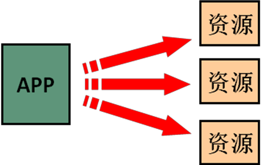
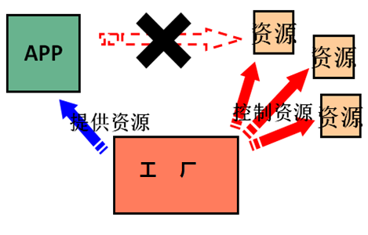
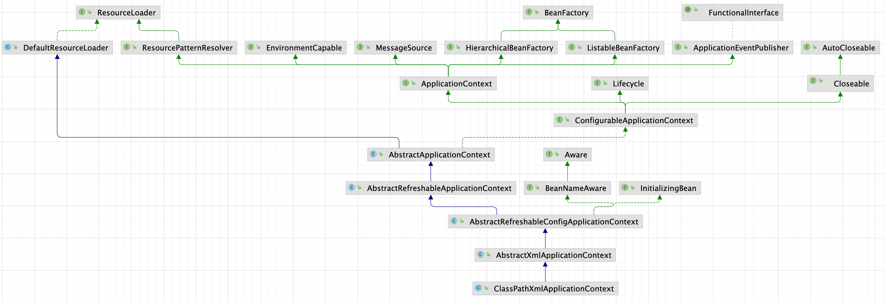

# Spring5 第一天

## 第一章 Spring5 概述

### 1.1 Spring是什么？

其实Spring是**Spring Projects项目**的其中的一个项目，名称为**spring-framework**。

Spring Framework 为基于 Java 的现代企业应用程序提供了一个全面的编程和配置模型——在任何类型的部署平台上。

Spring 的一个关键元素是应用程序级别的基础设施支持：Spring 专注于企业应用程序的“管道”，因此团队可以专注于应用程序级别的业务逻辑，而无需与特定部署环境建立不必要的联系。

**Github地址**：[https://github.com/spring-projects/spring-framework/](https://github.com/spring-projects/spring-framework/)

**Spring的前世**：[https://www.interface21.io/](https://www.interface21.io/)

### 1.2 Spring的发展历程

1997 年 IBM 提出了 EJB 的思想

1998 年，SUN 制定开发标准规范 EJB1.0

1999 年，EJB1.1 发布

2001 年，EJB2.0 发布

2003 年，EJB2.1 发布

2006 年，EJB3.0 发布

**Rod Johnson（spring 之父）**

- Expert One-to-One J2EE Design and Development（2002）
- 阐述了 J2EE 使用 EJB 开发设计的优点及解决方案
- Expert One-to-One J2EE Development without EJB（2004）
- 阐述了 J2EE 开发不使用 EJB 的解决方式（Spring 雏形）

**2017 年 9 月份发布了 spring 的最新版本 spring 5.0 通用版（GA）**

### 1.3 Spring的特性

- [核心技术](https://docs.spring.io/spring-framework/docs/current/spring-framework-reference/core.html)：依赖注入、事件、资源、i18n、验证、数据绑定、类型转换、SpEL、AOP。
- [测试](https://docs.spring.io/spring-framework/docs/current/spring-framework-reference/testing.html)：模拟对象、TestContext 框架、Spring MVC 测试、`WebTestClient`.
- [数据访问](https://docs.spring.io/spring-framework/docs/current/spring-framework-reference/data-access.html)：事务、DAO 支持、JDBC、ORM、编组 XML。
- [Spring MVC](https://docs.spring.io/spring/docs/current/spring-framework-reference/web.html)和 [Spring WebFlux](https://docs.spring.io/spring/docs/current/spring-framework-reference/web-reactive.html) Web 框架。
- [集成](https://docs.spring.io/spring-framework/docs/current/spring-framework-reference/integration.html)：远程处理、JMS、JCA、JMX、电子邮件、任务、调度、缓存。
- [语言](https://docs.spring.io/spring-framework/docs/current/spring-framework-reference/languages.html)：Kotlin、Groovy、动态语言。

### 1.4 Spring的优势

**方便解耦，简化开发**

通过 Spring 提供的 IoC 容器，可以将对象间的依赖关系交由 Spring 进行控制，避免硬编码所造成的过度程序耦合。用户也不必再为单例模式类、属性文件解析等这些很底层的需求编写代码，可以更专注于上层的应用。

**AOP编程的支持**

通过 Spring 的 AOP 功能，方便进行面向切面的编程，许多不容易用传统 OOP 实现的功能可以通过 AOP 轻松应付。

**声明式事务的支持**

可以将我们从单调烦闷的事务管理代码中解脱出来，通过声明式方式灵活的进行事务的管理，提高开发效率和质量。

**方便程序的测试**

可以用非容器依赖的编程方式进行几乎所有的测试工作，测试不再是昂贵的操作，而是随手可做的事情。

**方便集成各种优秀框架**

Spring 可以降低各种框架的使用难度，提供了对各种优秀框架（Struts、Hibernate、Hessian、Quartz等）的直接支持。

**降低 JavaEE API 的使用难度**

Spring 对 JavaEE API（如 JDBC、JavaMail、远程调用等）进行了薄薄的封装层，使这些 API 的使用难度大为降低。

**Java 源码是经典学习范例**

Spring 的源代码设计精妙、结构清晰、匠心独用，处处体现着大师对 Java 设计模式灵活运用以及对 Java 技术的高深造诣。它的源代码无意是 Java 技术的最佳实践的范例。

### 1.5 Spring的体系结构


Spring框架至今已集成了20多个模块，这些模块分布在以下模块中：

- 核心容器（Core Container）
- 数据访问/集成（Data Access/Integration）层
- Web层
- AOP（Aspect Oriented Programming）模块
- 植入（Instrumentation）模块
- 消息传输（Messaging）
- 测试（Test）模块

---

## 第二章 IOC 的概念和作用

### 2.1 什么是耦合？

耦合性(Coupling)，也叫耦合度，是对模块间关联程度的度量。耦合的强弱取决于模块间接口的复杂性、调用模块的方式以及通过界面传送数据的多少。模块间的耦合度是指模块之间的依赖关系，包括控制关系、调用关系、数据传递关系。模块间联系越多，其耦合性越强，同时表明其独立性越差( 降低耦合性，可以提高其独立性)。耦合性存在于各个领域，而非软件设计中独有的，但是我们只讨论软件工程中的耦合。

在软件工程中，耦合指的就是就是对象之间的依赖性。对象之间的耦合越高，维护成本越高。因此对象的设计应使类和构件之间的耦合最小。软件设计中通常用耦合度和内聚度作为衡量模块独立程度的标准。**划分模块的一个**

**准则就是高内聚低耦合。**

**它有如下分类：**

（1）内容耦合。当一个模块直接修改或操作另一个模块的数据时，或一个模块不通过正常入口而转入另一个模块时，这样的耦合被称为内容耦合。内容耦合是最高程度的耦合，应该避免使用之。

（2）公共耦合。两个或两个以上的模块共同引用一个全局数据项，这种耦合被称为公共耦合。在具有大量公共耦合的结构中，确定究竟是哪个模块给全局变量赋了一个特定的值是十分困难的。

（3） 外部耦合 。一组模块都访问同一全局简单变量而不是同一全局数据结构，而且不是通过参数表传递该全局变量的信息，则称之为外部耦合。

（4） 控制耦合 。一个模块通过接口向另一个模块传递一个控制信号，接受信号的模块根据信号值而进行适当的动作，这种耦合被称为控制耦合。

（5）标记耦合 。若一个模块 A 通过接口向两个模块 B 和 C 传递一个公共参数，那么称模块 B 和 C 之间存在一个标记耦合。

（6） 数据耦合。模块之间通过参数来传递数据，那么被称为数据耦合。数据耦合是最低的一种耦合形式，系统中一般都存在这种类型的耦合，因为为了完成一些有意义的功能，往往需要将某些模块的输出数据作为另一些模块的输入数据。

（7） 非直接耦合 。两个模块之间没有直接关系，它们之间的联系完全是通过主模块的控制和调用来实现的。

**总结：**

耦合是影响软件复杂程度和设计质量的一个重要因素，在设计上我们应采用以下原则：如果模块间必须存在耦合，就尽量使用数据耦合，少用控制耦合，限制公共耦合的范围，尽量避免使用内容耦合。

**内聚与耦合**

内聚标志一个模块内各个元素彼此结合的紧密程度，它是信息隐蔽和局部化概念的自然扩展。内聚是从功能角度来度量模块内的联系，一个好的内聚模块应当恰好做一件事。它描述的是模块内的功能联系。耦合是软件结构中各模块之间相互连接的一种度量，耦合强弱取决于模块间接口的复杂程度、进入或访问一个模块的点以及通过接口的数据。 程序讲究的是低耦合，高内聚。就是同一个模块内的各个元素之间要高度紧密，但是各个模块之间的相互依存度却要不那么紧密。内聚和耦合是密切相关的，同其他模块存在高耦合的模块意味着低内聚，而高内聚的模块意味着该模块同其他模块之间是低耦合。在进行软件设计时，应力争做到高内聚，低耦合。

**在Java应用程序中的耦合的体现一般都是在类与类之间，方法与方法之间的依赖关系上**。

### 2.2 JDBC案例说明程序之间的耦合

初始化数据库脚本

```sql
-- 创建 spring5_super 数据库
create
database `spring5_super` character set utf8mb4 collate utf8mb4_general_ci;

-- 使用 spring5_super 数据库
use
`spring5_super`;

-- 创建表 `tb_account`
create table `tb_account`
(
    id    bigint auto_increment comment '主键',
    name  varchar(20) comment '姓名',
    money double comment '账户金额',
    primary key (id)
) engine=InnoDB character set utf8mb4 comment '账户表';

-- 给 `tb_account` 添加数据
insert into `tb_account`(id, name, money)
values (default, '张三', 1000),
       (default, '李四', 1000),
       (default, '王五', 1000);

```

创建一个JdbcDemo类

```java
public class JdbcDemo {
    public static void main(String[] args) throws Exception {
        // 1.注册驱动
        DriverManager.deregisterDriver(new Driver());
        // 2.获取连接
        Connection connection = DriverManager.getConnection("jdbc:mysql://数据库IP地址:端口号/数据库名称?useSSL=true&useUnicode=true&characterEncoding=UTF-8&serverTimezone=Asia/Shanghai&autoReconnect=true", "账户名", "密码");
        // 3.获取操作数据库的预处理对象
        PreparedStatement preparedStatement = connection.prepareStatement("select * from tb_account");
        // 4.执行SQL获取结果集
        ResultSet resultSet = preparedStatement.executeQuery();
        // 5.遍历结果集
        while (resultSet.next()) {
            System.out.println("id = " + resultSet.getInt(1) + "，name = " + resultSet.getString(2) + "，money = " + resultSet.getDouble(3));
        }
        // 6.释放资源
        resultSet.close();
        preparedStatement.close();
        connection.close();
    }
}
```

运行结果：

```sh
id = 1，name = 张三，money = 1000.0
id = 2，name = 李四，money = 1000.0
id = 3，name = 王五，money = 1000.0
```

当我们在Maven工程中移除MySQL驱动时再次运行会发现，此时的程序就运行不起来，出现一个错误❌。


这种情况就是我们所说的程序之间的耦合，jdbc应用程序再没有依赖MySQL数据库驱动的情况下是运行不起来的；此时使用Maven插件Compile是不通过的，程序在编译期间就开始报错；

我们使用Java的反射机制，将MySQL数据库驱动在程序编译期间依赖，转移到程序运行时期依赖。

```java
public class JdbcDemo {
    public static void main(String[] args) throws Exception {
        // 1.注册驱动
//        DriverManager.deregisterDriver(new Driver());
        Class.forName("com.mysql.cj.jdbc.Driver");
        // 2.获取连接
        Connection connection = DriverManager.getConnection("jdbc:mysql://数据库IP地址:端口号/数据库名称?useSSL=true&useUnicode=true&characterEncoding=UTF-8&serverTimezone=Asia/Shanghai&autoReconnect=true", "账户名", "密码");
        // 3.获取操作数据库的预处理对象
        PreparedStatement preparedStatement = connection.prepareStatement("select * from tb_account");
        // 4.执行SQL获取结果集
        ResultSet resultSet = preparedStatement.executeQuery();
        // 5.遍历结果集
        while (resultSet.next()) {
            System.out.println("id = " + resultSet.getInt(1) + "，name = " + resultSet.getString(2) + "，money = " + resultSet.getDouble(3));
        }
        // 6.释放资源
        resultSet.close();
        preparedStatement.close();
        connection.close();
    }
}
```

### 2.3 工厂模式降低耦合

**工厂模式降低耦合案例**

传统的三层架构在没有使用使用工厂模式时各层的依赖关系如下：

```mermaid
graph LR
表现层 -->|调用| 业务层 -->|调用| 持久层 --> |操作| 数据库
数据库 -->|返回数据| 持久层 -->|返回数据| 业务层 -->|返回数据| 表现层
```

表现层

```java
public class AccountController {
    public static void main(String[] args) {
        // 表现层依赖业务层
        IAccountService accountService = new IAccountServiceImpl();
        accountService.saveAccount();
    }
}
```

业务层

```java
public interface IAccountService {
    void saveAccount();
}
```

```java
public class IAccountServiceImpl implements IAccountService {
    
    // 业务层依赖持久层
    private IAccountDao accountDao = new IAccountDaoImpl();

    @Override
    public void saveAccount() {
        accountDao.saveAccount();
    }
}
```

持久层

```java
public interface IAccountDao {
    void saveAccount();
}
```

```java
public class IAccountDaoImpl implements IAccountDao {
    @Override
    public void saveAccount() {
        System.out.println("模拟保存账户");
    }
}
```

由上面的代码可以看出各层之间的耦合度都是比较强的，此时要是将`IAccountDaoImpl`类删除，代码会直接在编译时期就会失败，我们说明需要将程序编译时依赖转换成程序运行时依赖。

案例改造使用工厂模式降低程序耦合。

bean工厂

```java
// 模拟Bean工厂用于生产bean的实例化对象
public class BeanFactory {

    /** properties对象 */
    private static Properties properties;

    /** beans对象用于存储bean */
    private static Map<String, Object> beans;

    static {
        try {
            properties = new Properties();
            beans = new HashMap<String, Object>();
            properties.load(BeanFactory.class.getClassLoader().getResourceAsStream("beans.properties"));
            // 获取所有的key
            Enumeration<Object> keys = properties.keys();
            while (keys.hasMoreElements()) {
                String key = keys.nextElement().toString();
                Object beanPath = properties.get(key);
                // 根据获取出来的value去实例化对象
                Object instance = Class.forName(beanPath.toString()).newInstance();
                // 将beanName作为key和实例化对象作为value存入map容器中
                beans.put(key, instance);
            }
        } catch (Exception e) {
            throw new ExceptionInInitializerError("初始化properties失败");
        }
    }

    /**
     * 通过bean的名称获取bean
     * @param beanName bean的名称
     * @return 返回一个bean对象
     */
    public static Object getBean(String beanName) {
        return beans.get(beanName);
    }
}
```

表现层

```java
public class AccountController {
    public static void main(String[] args) {
        // 表现层依赖业务层的接口
//        IAccountService accountService = new IAccountServiceImpl();
        // 通过工厂的方式获取IAccountService的实例化对象
        IAccountService accountService = (IAccountService) BeanFactory.getBean("accountService");
        accountService.saveAccount();
    }
}
```

业务层

```java
public interface IAccountService {
    void saveAccount();
}
```

```java
public class IAccountServiceImpl implements IAccountService {

    // 业务层依赖持久层
//    private IAccountDao accountDao = new IAccountDaoImpl();

    // 工厂的方式获取IAccountDao实例化对象
    private IAccountDao accountDao = (IAccountDao) BeanFactory.getBean("accountDao");

    @Override
    public void saveAccount() {
        accountDao.saveAccount();
    }
}
```

持久层

```java
public interface IAccountDao {
    void saveAccount();
}
```

```java
public class IAccountDaoImpl implements IAccountDao {
    @Override
    public void saveAccount() {
        System.out.println("模拟保存账户");
    }
}
```

### 2.4 控制反转（Inversion Of Control）

上面案例中解耦的思路有 2 个问题：

1.实例化的对象存在哪？

分析：由于我们是很多对象，肯定要找个集合来存。这时候有 Map 和 List 供选择。到底选 Map 还是 List 就看我们有没有查找需求。有查找需求，选 Map。所以我们的答案就是，在应用加载时，创建一个 Map，用于存放三层对象。我们把这个 map 称之为**容器**。

2.还是没解释什么是工厂？

工厂就是负责给我们从容器中获取指定对象的类。这时候我们获取对象的方式发生了改变。

原来：我们在获取对象时，都是采用 new 的方式。是**主动**的。



现在：我们获取对象时，同时跟工厂要，有工厂为我们查找或者创建对象。是**被动**的。



这种被动接收的方式获取对象的思想就是控制反转，它是 Spring 框架的核心之一。

**明确IOC的作用**：削减计算机程序的耦合(解除我们代码中的依赖关系)。 

---

## 第三章 使用Spring的IOC降低程序耦合

### 3.1 Spring入门案例

Spring官网：[https://spring.io](https://spring.io)

Spring官网仓库：[https://repo.spring.io/ui/repos/tree/General/release/org/springframework/spring](https://repo.spring.io/ui/repos/tree/General/release/org/springframework/spring)

创建一个Maven工程，然后导入Spring的Maven坐标。

```xml
<!-- spring-context -->
<dependency>
  <groupId>org.springframework</groupId>
  <artifactId>spring-context</artifactId>
  <version>5.3.19</version>
</dependency>
```

创建HelloWorld类

```java
public class HelloWorld {

    private String message;

    public String getMessage() {
        return message;
    }

    public void setMessage(String message) {
        this.message = message;
    }
}
```

创建Spring的配置文件

```xml
<?xml version="1.0" encoding="UTF-8"?>
<beans xmlns="http://www.springframework.org/schema/beans"
       xmlns:xsi="http://www.w3.org/2001/XMLSchema-instance"
       xsi:schemaLocation="http://www.springframework.org/schema/beans
        https://www.springframework.org/schema/beans/spring-beans.xsd">


    <!-- 将HelloWorld类交给Spring容器管理 -->
    <bean id="helloWorld" class="com.matrix.study.hello.HelloWorld">
        <property name="message" value="Hello Spring"/>
    </bean>
</beans>
```

测试类

```java
public class SpringTest {
    public static void main(String[] args) {
        // 1.读取spring配置文件创建bean容器
        ApplicationContext applicationContext = new ClassPathXmlApplicationContext("spring/spring-beans.xml");
        // 2.根据bean的名称获取bean对象
        HelloWorld helloWorld = (HelloWorld) applicationContext.getBean("helloWorld");
        System.out.println(helloWorld);
        System.out.println(helloWorld.getMessage());
    }
}
```

### 3.2 BeanFactory 和 ApplicationContext 的区别

BeanFactory 才是 Spring 容器中的顶层接口。

ApplicationContext 是它的子接口。

BeanFactory 和 ApplicationContext 的区别：

- 创建对象的时间点不一样。
  - ApplicationContext：只要一读取配置文件，默认情况下就会创建对象。
  - BeanFactory：什么使用什么时候创建对象。

### 3.3 ApplicationContext接口的实现类

ClassPathXmlApplicationContext类：它是从类的根路径下加载配置文件。



FileSystemXmlApplicationContext类：它是从磁盘路径上加载配置文件，配置文件可以在磁盘的任意位置，访问的文件必须要有权限。


AnnotationConfigApplicationContext类：当我们使用注解配置容器对象时，需要使用此类来创建 Spring 容器。它用来读取注解。


### 3.4 bean标签

作用：用于配置bean对象让 Spring 来创建的，默认情况下它调用的是类中的无参构造函数，如果没有无参构造函数则不能创建成功。

属性：

- id：给对象在容器中提供一个唯一标识。用于获取对象。
- class：指定类的全限定类名。用于反射创建对象。默认情况下调用无参构造函数。
- name：给对象在容器中提供一个唯一标识，和id属性一样作用。
- scope：指定对象的作用范围。
  - singleton：单例对象，默认值。
  - prototype：多例对象。
  - request：WEB 项目中,Spring 创建一个 Bean 的对象,将对象存入到 request 域中。
  - session：WEB 项目中,Spring 创建一个 Bean 的对象,将对象存入到 session 域中。
  - global session：WEB 项目中,应用在 Portlet 环境.如果没有 Portlet 环境那么globalSession 相当于 session。
- init-method：指定类中的初始化方法名称。
- destroy-method：指定类中销毁方法名称。

### 3.5 bean的作用范围和生命周期

单例对象：scope="singleton"

一个应用只有一个对象的实例。它的作用范围就是整个引用。

生命周期：

- 对象出生：当应用加载，创建容器时，对象就被创建了。
- 对象活着：只要容器在，对象一直活着。
- 对象死亡：当应用卸载，销毁容器时，对象就被销毁了。

多例对象：scope="prototype"

每次访问对象时，都会重新创建对象实例。

生命周期：

- 对象出生：当使用对象时，创建新的对象实例。
- 对象活着：只要对象在使用中，就一直活着。
- 对象死亡：当对象长时间不用时，被 java 的垃圾回收器回收了。

### 3.6 bean的实例化三种方式

#### 方式一：使用默认的构造函数

将HelloWorld类的默认构造函数加入参数

```java
public class HelloWorld {

    public HelloWorld(String message, String name) {
        this.message = message;
    }

    private String message;

    public String getMessage() {
        return message;
    }

    public void setMessage(String message) {
        this.message = message;
    }
}
```

然后再运行，会抛出`BeanCreationException`异常


说明默认的构造函数被覆盖之后，实例化bean对象是不能成功的！

#### 方式二：使用Spring管理的工厂实例，使用实例工厂的方法创建bean对象

创建一个实例化工厂交给Spring管理，用于模拟jar包中的类

```java
public class HelloWorldFactory {

    /**
     * 获取HelloWorld实例
     *
     * @return 返回HelloWorld类的实例化对象
     */
    public HelloWorld getHelloWorld() {
        return new HelloWorld();
    }
}
```

修改spring-beans.xml配置文件

```xml
<!-- 第二种：使用Spring管理的工厂实例，使用实例工厂的方法创建bean对象-->
<!-- 此种方式是:
        先把工厂的创建交给 spring 来管理。
        然后在使用工厂的 bean 来调用里面的方法
        factory-bean 属性：用于指定实例工厂 bean 的 id。
        factory-method 属性：用于指定实例工厂中创建对象的方法。
    -->
<bean id="helloWorldFactory" class="com.matrix.study.factory.HelloWorldFactory">

</bean>
<bean id="helloWorld" factory-bean="helloWorldFactory" factory-method="getHelloWorld">
  <property name="message" value="Factory get HelloWorld"/>
</bean>
```

#### 方式三：使用Spring管理的静态工厂实例，使用静态工厂的静态方法创建bean对象

创建一个实例化静态工厂交给Spring管理，用于模拟jar包中的类

```java
public class HelloWorldStaticFactory {

    /**
     * 获取HelloWorld实例
     *
     * @return 获取HelloWorld类的实例化对象
     */
    public static HelloWorld getStaticHelloWorld() {
        return new HelloWorld();
    }
}
```

修改spring-beans.xml配置文件

```xml
<!-- 方式三：使用Spring管理的静态工厂实例，使用静态工厂的静态方法创建bean对象 -->
<!-- 此种方式是:
        使用 StaticFactory 类中的静态方法 createAccountService 创建对象，并存入 spring 容器
        id 属性：指定 bean 的 id，用于从容器中获取
        class 属性：指定静态工厂的全限定类名
        factory-method 属性：指定生产对象的静态方法
    -->
<bean id="helloWorld" class="com.matrix.study.factory.HelloWorldStaticFactory" factory-method="getStaticHelloWorld">
  <property name="message" value="StaticFactory get HelloWorld"/>
</bean>
```

### 3.7 Spring的依赖注入

#### 依赖注入的概述

依赖注入：**Dependency Injection**。它是 Spring 框架核心 IOC 的具体实现。

我们的程序在编写时，通过控制反转，把对象的创建交给了 Spring，但是代码中不可能出现没有依赖的情况。IOC  解耦只是降低他们的依赖关系，但不会消除。例如：我们的业务层仍会调用持久层的方法。

那这种业务层和持久层的依赖关系，在使用 Spring 之后，就让 Spring 来维护了。

简单的说，就是坐等框架把持久层对象传入业务层，而不用我们自己去获取。

依赖注入能够注入的数据类型有三类：

- 基本类型和String类型
- 其他bean类型（在配置文件中或者注解配置过的bean）
- 复杂类型和集合类型

依赖注入的方式有三种：

- 构造函数注入
- set方法注入
- 使用注解的方式注入

#### 构造注入

创建一个HelloWorld类

```java
public class HelloWorld {
    
    private String name;
    private Integer age;
    private Date date;

    /** 复杂的数据类型 */
    private String[] stringArray;

    private List<String> stringList;

    private Map<String, String> stringMap;

    private Set<String> stringSet;

    private Properties properties;

    public HelloWorld(String name, Integer age, Date date, String[] stringArray, List<String> stringList, Map<String, String> stringMap, Set<String> stringSet, Properties properties) {
        this.name = name;
        this.age = age;
        this.date = date;
        this.stringArray = stringArray;
        this.stringList = stringList;
        this.stringMap = stringMap;
        this.stringSet = stringSet;
        this.properties = properties;
    }

    public void printInfo() {
        System.out.println("name=" + name + ", age=" + age + ", date=" + date);
        System.out.println("array=" + Arrays.toString(stringArray));
        System.out.println("list=" + stringList.toString());
        System.out.println("map=" + stringMap.toString());
        System.out.println("set=" + stringSet.toString());
        System.out.println("properties=" + properties.toString());
    }
}
```

创建spring配置文件

```xml
<?xml version="1.0" encoding="UTF-8"?>
<beans xmlns="http://www.springframework.org/schema/beans"
       xmlns:xsi="http://www.w3.org/2001/XMLSchema-instance"
       xsi:schemaLocation="http://www.springframework.org/schema/beans
        https://www.springframework.org/schema/beans/spring-beans.xsd">

    <!-- 依赖注入方式一：构造注入 -->
    <bean id="helloWorld" class="com.matrix.study.demo1.hello.HelloWorld">
        <!--
        constructor-arg标签：用于构造注入参数
            index属性：指定参数在构造函数参数列表的索引位置
            type属性：指定参数在构造函数中的数据类型
            name属性：指定参数在构造函数中的名称
        =======上面三个都是找给谁赋值，下面两个指的是赋什么值的==============
            value属性：它能赋的值是基本数据类型和 String 类型
            ref属性：它能赋的值是其他 bean 类型，也就是说，必须得是在配置文件中配置过的 bean
        -->
        <constructor-arg name="name" value="Matrix"/>
        <constructor-arg name="age" value="23"/>
        <constructor-arg name="date" ref="date"/>

        <!-- 数组类型-->
        <constructor-arg name="stringArray">
            <!-- array标签：表示数组 -->
            <array>
                <value>1</value>
                <value>2</value>
                <value>3</value>
            </array>
        </constructor-arg>
        <!-- 集合类型 -->
        <constructor-arg name="stringList">
            <!-- list标签：表示集合 -->
            <list>
                <value>4</value>
                <value>5</value>
                <value>6</value>
            </list>
        </constructor-arg>

        <!-- map类型 -->
        <constructor-arg name="stringMap">
            <!-- map标签：表示map类型的数据结构kv -->
            <map>
                <entry key="matrix" value="qiqi"/>
            </map>

<!--            <props>-->
<!--                <prop key="matrix">qiqi</prop>-->
<!--            </props>-->
        </constructor-arg>

        <!-- set类型 -->
        <constructor-arg name="stringSet">
            <!-- set标签：表示set类型的数据结构 -->
            <set>
                <value>7</value>
                <value>7</value>
                <value>8</value>
            </set>
        </constructor-arg>

        <constructor-arg name="properties">
            <!-- props标签：表示properties类型的数据结构，也是key value的 -->
            <props>
                <prop key="java"> spring</prop>
            </props>

<!--            <map>-->
<!--                <entry key="golang" value="gin"/>-->
<!--            </map>-->
        </constructor-arg>
    </bean>
    <bean id="date" class="java.util.Date"></bean>

</beans>
```

测试类

```java
public class SpringTest {
    public static void main(String[] args) {
        // 1.读取spring配置文件创建bean容器
        ApplicationContext applicationContext = new ClassPathXmlApplicationContext("spring/demo1/spring-beans.xml");
        // 2.根据bean的名称获取bean对象
        HelloWorld helloWorld = (HelloWorld) applicationContext.getBean("helloWorld");
        System.out.println(helloWorld);
        helloWorld.printInfo();
    }
}
```

#### set方法注入

#### 使用注解的方式注入


